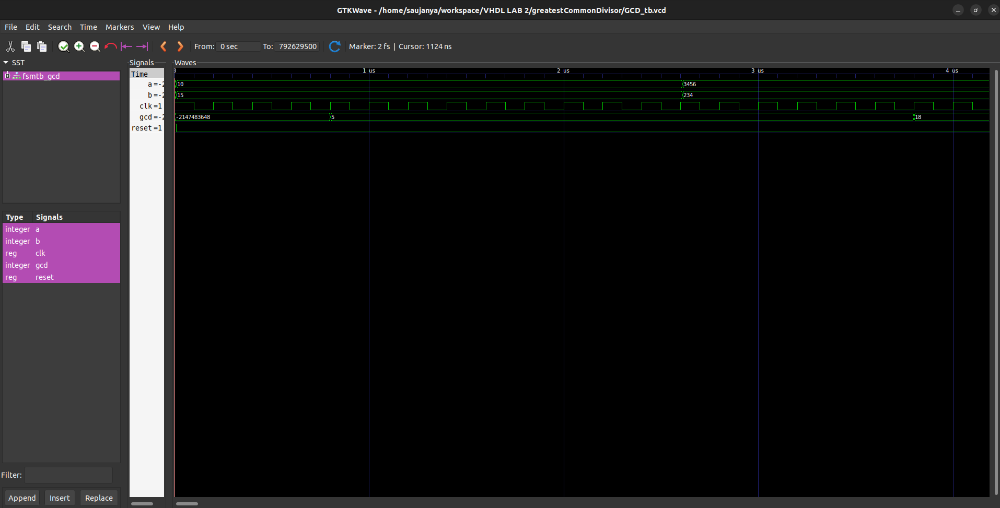

<h1>GCD solution using VHDL.</h1>
<h2>2069 Bhadra</h2>

Write the VHDL code for processor (GCD) that calculates greatest common divisor of two integer data with its state diagram.

<h2>State Diagram</h2>

